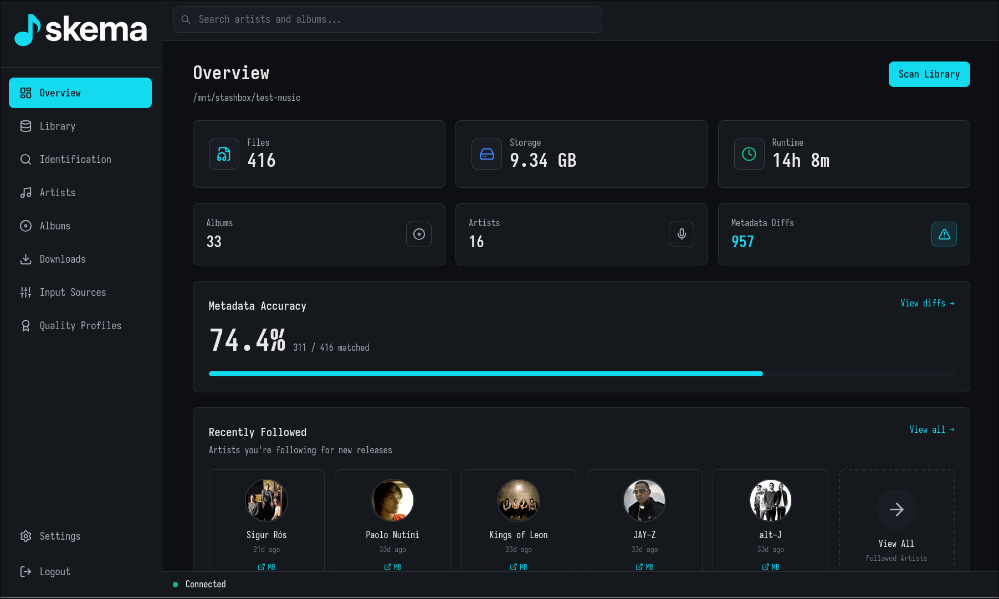

# Skema

skema is a music library management/acquisition system.

<p align="center">
  
</p>

> ⚠️ **Note**: This is a proof-of-concept project. It's functional but has lots of rough edges.

## Quick Start

### Using Nix (Recommended)

```bash
# Enter development shell with all dependencies
nix develop

# Run backend and frontend in separate terminals:
# Terminal 1:
./dev.sh server  # Backend with auto-reload

# Terminal 2:
./dev.sh web     # Frontend dev server
```

The `dev.sh` script provides auto-reload on code changes for the backend and hot-reload for the frontend.

### Using Docker

```bash
# 1. Create required directories
mkdir -p config data cache

# 2. Create a basic config file
cat > config/config.yaml << 'EOF'
library:
  path: "/music"
EOF

# 3. Pull and run the latest image
docker pull rembo10/skema:latest

docker run -d \
  --name skema \
  -p 8182:8182 \
  -v ./config:/config \
  -v ./data:/data \
  -v ./cache:/cache \
  -v /path/to/your/music:/music \
  -e SKEMA_HOST=0.0.0.0 \
  rembo10/skema:latest

# Or use docker-compose
docker-compose up -d
```

**Configuration:**
- Edit `config/config.yaml` to customize settings
- Set environment variables:
  - `SKEMA_HOST=0.0.0.0` (required for Docker)
  - `SKEMA_PORT=8182` (optional)
  - `SKEMA_USERNAME` / `SKEMA_PASSWORD` (optional authentication)
  - `SKEMA_JWT_SECRET` (optional, hex-encoded 256-bit secret for JWT signing. Auto-generated if not provided)

The application will be available at `http://localhost:8182`.

**Building locally:**
Edit the docker-compose.yml file to uncomment the `build:` directive, and comment out the `image:` line. Then run:

```bash
docker-compose build
docker-compose up -d
```

### Manual Setup

If not using Nix, you'll need to install the following dependencies:

**Prerequisites:**
- GHC 9.10.3
- Cabal 3.4+
- Node.js & npm
- SQLite

**System dependencies:**

```bash
# Ubuntu/Debian
sudo apt-get install zlib1g-dev libsqlite3-dev

# macOS
brew install zlib sqlite3
```

Then run the services:

```bash
# Backend
cd server
cabal run skema

# Frontend (in another terminal)
cd web
npm install
npm run dev
```

The backend will run on `http://localhost:8182` and the frontend on `http://localhost:3000`.

## License

Unlicense - see LICENSE for details.
